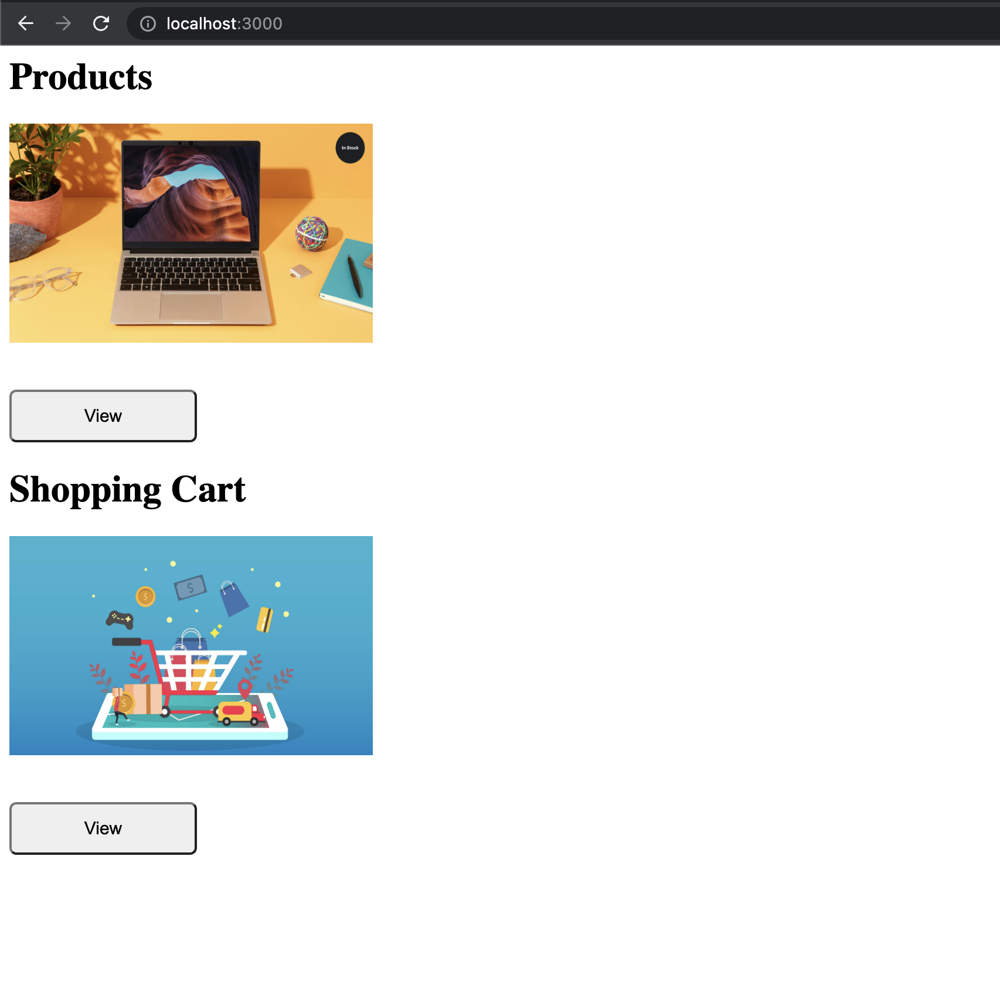
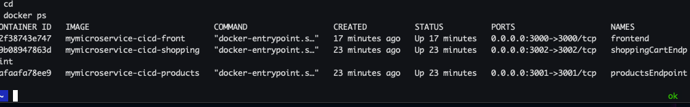
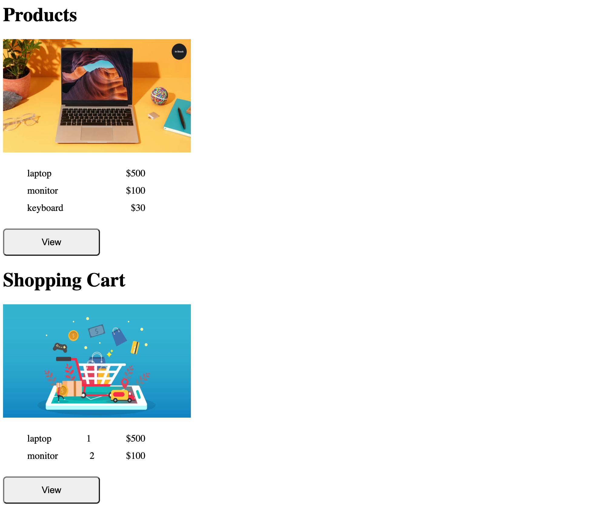

### CHALLENGE FINAL Bootcamp DevOps

La empresa ZERO Technology, solicita al Equipo de DevOps Trainer, la contenerizacion de su aplicacion "Products DevOps" en la que incluye:

- Frontend
- Backend: products & shopping-cart

#### Frontend
Aplicacion realizada en express y se expone en el puerto 3000

### Backend products
Aplicacion realizada en express y se expone en el puerto 3001

### Backend shopping-cart
Aplicacion realizada en express y se expone en el puerto 3002


#### Build Docker 
- Para construir ejecutamos lo siguiente:
```
    docker build -t ms-frontend:1.0 frontend
    docker build -t ms-products:1.0 products
    docker build -t ms-shopping-cart:1.0 shopping-cart
```
#### Prueba Local
    cd micro-service-name 
    npm install
    npm run
    

#### Iniciar los contenedores 
    docker run -d -p 3000:3000 \
    -e PRODUCTS_SERVICE=host.docker.internal \
    -e SHOPPING_CART_SERVICE=host.docker.internal \
    ms-frontend:1.0

    docker run -d -p 3001:3001 ms-products:1.0
    docker run -d -p 3002:3002 ms-shopping-cart:1.0

## Entrega

### Infra:
- Aprovisionar 3 servidores AWS EC2 con Terraform (server-dev, server-tst, server-prd)
- Crear los ficheros de terraform + userdata (docker+docker-compose)
- Crear Repositorio Github para la infra
- Diagrama Arquitectura Infra 

### Aplicación:
- Diseño de Diagrama de la aplicacion
- Crear Repositorio Github para el Codigo
- Crear las ramas (develop, Testing, Master) en el Repositorio

### Despliegue Pueden escoger entre Jenkins ó Github Actions

#### Despliegue Usando Jenkins to AWS EC2 
- Crear Jenkinsfile
- Controlar la version de la aplicacion
- Contenerizar la aplicacion y publicarla en el registry de docker-hub
- Crear Docker-compose 
- Configurar Webhook
- Crear Notificacion de Despliegue vía Telegram

#### Despliegue Usando Github to AWS EC2 
- Crear .github/workflows/deploy.yaml
- Controlar la version de la aplicacion
- Contenerizar la aplicacion y publicarla en el registry de docker-hub
- Crear Docker-compose 
- Configurar Webhook
- Crear Notificacion de Despliegue vía Telegram


### Despliegues en Kubernetes

- Crear los manifiestos de kubernetes
- Diseñar la Arquitectura de Objetos k8s
- Desplegarlos en Killercoda 

### Adicional 
- Crear Documentación
- Buenas practicas

## Resultado




